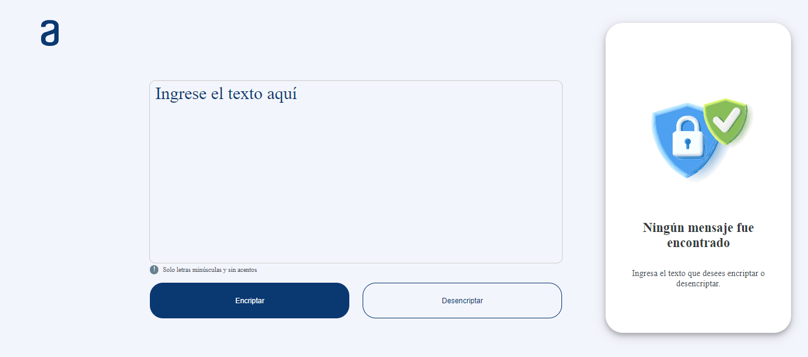
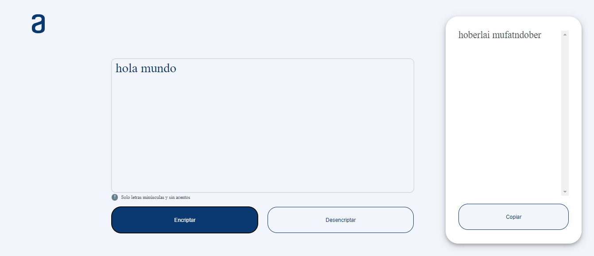

# challenge-encriptador-de-texto

Descripción
Esta aplicación permite encriptar y desencriptar texto utilizando un método específico de sustitución de caracteres. Desarrollado con
JavaScript, HTML y CSS.

## Características
- Campo de texto: Ingrese el texto que desea encriptar o desencriptar.
- Botón de encriptar: Convierte el texto ingresado en un formato encriptado.
- Botón de desencriptar: Convierte el texto encriptado de nuevo a su forma original.
- Campo de resultados: Muestra el resultado del proceso de encriptado o desencriptado.
- Botón de copiar: Permite copiar el resultado al portapapeles.

## Encriptado
El proceso de encriptado reemplaza las vocales en el texto de la siguiente manera:

- a se convierte en ai
- e se convierte en enter
- i se convierte en imes
- o se convierte en ober
- u se convierte en ufat 

Por ejemplo, el texto "hola mundo" se encriptará como "hoberlai mufatndober".

## Desencriptado
El proceso de desencriptado realiza la operación inversa, reemplazando los juegos de caracteres por las vocales originales:

- ai se convierte en a
- enter se convierte en e
- imes se convierte en i
- ober se convierte en o
- ufat se convierte en u

Por ejemplo, el texto encriptado "hoberlai mufatndober" se desencriptará como "hola mundo".

## Cómo Usar
1. Ingrese el texto: Escriba el texto en letras minúsculas y sin caracteres especiales en el campo de texto.
2. Encriptar el texto: Haga clic en el botón "Encriptar" para convertir el texto a su forma encriptada.
3. Desencriptar el texto: Haga clic en el botón "Desencriptar" para convertir el texto encriptado de vuelta a su forma original.
4. Copiar el resultado: Use el botón "Copiar" para copiar el texto del campo de resultados al portapapeles.